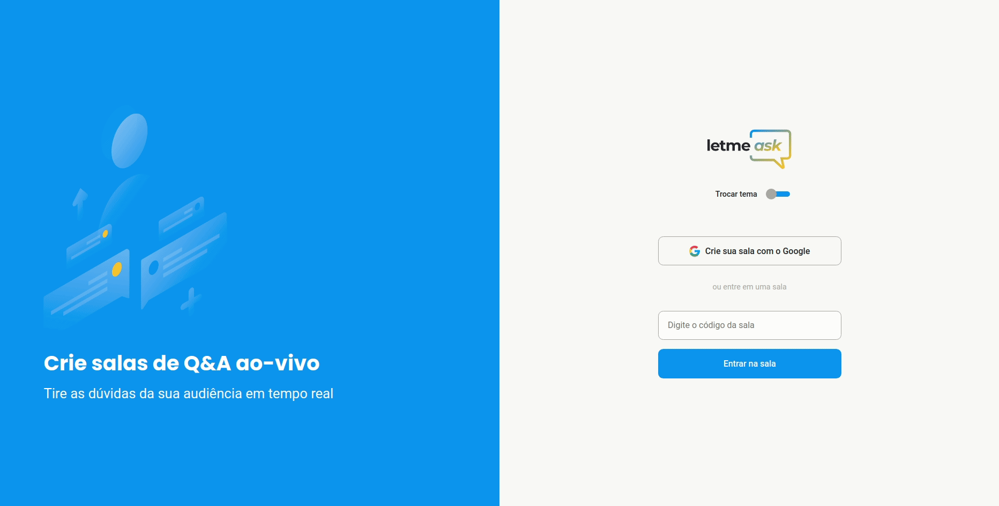

<h1 align="center">
  
</h1>

  

# :page_with_curl: Índice

* [Sobre o projeto](#interrobang-sobre-o-projeto)
  - [Tecnologias utilizadas](#-tecnologias-utilizadas)
* [Executando a aplicação](#rocket-executando-a-aplicação)
  - [Executando a aplicação](#pencil2-Executando-a-aplicação)
* [Para contribuir](#mailbox-para-contribuir)
  - [Histórico de atualizações](#clock10-histórico-de-atualizações)

# :interrobang: Sobre o projeto

Projeto realizado durante a NLW#6 realizado pela Rocketseat. Foi desenvolvido um app para onde é possível realizar interação com usuários através de perguntas.
## 🧑‍💻 Tecnologias utilizadas

- [React](https://reactjs.org)
- [TypeScript](https://www.typescriptlang.org/)
- [Styled-components](https://styled-components.com/)
- [Firebase](https://firebase.google.com/)
# :rocket: Executando a aplicação

Primeiramente clone o repositório para sua maquina ou faça o 'download' em formato ZIP e descompacte. Para realizar a clonagem do repositório utilize o comando:

    git clone git@github.com:PedroHenry-Santos/Letmeask.git

Após basta instalar as dependência utilizando o gerenciador de pacote de sua preferência. Conforme abaixo:

    yarn install

E utilizar o comando:

    yarn start

Agora você pode acessar [`localhost:3000`](http://localhost:3000) do seu navegador.

Lembrando que será necessário criar uma conta no [Firebase](https://firebase.google.com/) e um projeto para disponibilizar um Realtime Database.
# :mailbox: Para contribuir

Caso queira ajudar a implementar novas funcionalidade nessa aplicação, poderá seguir o **roteiro de funcionalidades** a seguir. Ou também poderá propor sua própria funcionalidade.  
Para isso basta seguir o [roteiro](https://github.com/PedroHenry-Santos/Letmeask/blob/main/CONTRIBUTING.md) em CONTRIBUTING.

## :heavy_check_mark: Roteiro de funcionalidade da aplicação

Para um acompanhamento mais atualizado verifique a aba [Projeto](https://github.com/PedroHenry-Santos/Letmeask/projects/1).

- [x] Autenticação através de conta Google utilizando o Firebase. (:memo: Realizado durante o evento)
- [x] Criar sala de perguntas individuais. (:memo: Realizado durante o evento)
- [x] Adicionar novas perguntas na sala. (:memo: Realizado durante o evento)
- [x] Pagina do administrador das perguntas. (:memo: Realizado durante o eventos)
- [x] Like nas perguntas. (:memo: Realizado durante o evento)
- [x] Remover perguntas. (:memo: Realizado durante o evento)
- [x] Encerrar sala. (:memo: Realizado durante o evento)
- [x] Impedir que entre em uma sala fechada com código. (:memo: Realizado durante o evento)
- [x] Função de dar destaque a uma pergunta. (:memo: Realizado durante o evento)
- [x] Função de marcar pergunta respondida. (:memo: Realizado durante o evento)
- [x] Toast para notificação. (:rocket: Milhas extras...)
- [x] Modal de confirmação para exclusão e encerramento da chamada. (:rocket: Milhas extras...)
- [x] Temas de exibição (Light, Dark). (:rocket: Milhas extras...)
- [x] Animações na tela inicial e em todos os botões da aplicação com o [framer-motion](https://www.framer.com/motion/). (:rocket: Milhas extras...)
- [x] Mostrar se o usuário já esta autenticado na tela inicial e de criação de salas. (:rocket: Milhas extras...)
- [x] Funcionalidade de fechamento automático da sala para todos os usuários quando a sala for encerrada. (:rocket: Milhas extras...)
- [x] Direcionamento automático do administrador para a sala correspondente quando colocar o código na home. (:rocket: Milhas extras...)
- [x] As perguntas mais bem votadas são colocadas em primeiro lugar. (:rocket: Milhas extras...)
- [x] A pergunta respondida vai para à ultima posição. (:rocket: Milhas extras...)
- [x] A pergunta destacada vai para à primeira posição. (:rocket: Milhas extras...)
- [x] Funcionalidade para filtrar as 20 primeiras questões com firebase. (:rocket: Milhas extras...)
- [x] Responsividade. (:rocket: Milhas extras...)

## :clock10: Histórico de atualizações

Para saber sobre as [versões](https://github.com/PedroHenry-Santos/Letmeask/releases) deste código consulte o CHANGELOG detalhado.

# :lock: Licença

[MIT License](https://github.com/PedroHenry-Santos/Letmeask/blob/main/LICENCE.md) ® [Pedro Santos](https://github.com/PedroHenry-Santos)
